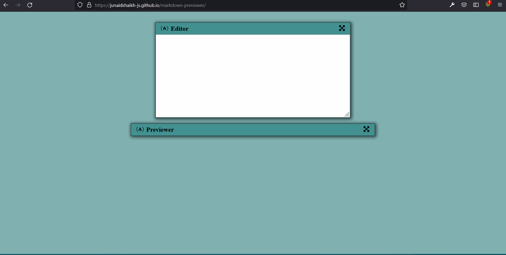

# FreeCodeCamp - Markdown Previewer

This is a solution to the [Build a Markdown Previewer](https://www.freecodecamp.org/learn/front-end-development-libraries/front-end-development-libraries-projects/build-a-markdown-previewer).

## Table of contents

- [Overview](#overview)
  - [The challenge](#the-challenge)
  - [Screenshot](#screenshot)
  - [Links](#links)
- [My process](#my-process)
  - [Built with](#built-with)
  - [What I learned](#what-i-learned)
- [Author](#author)

## Overview

### The challenge

The challenge is to fulfill the user-stories given in the challenge and build a react markdown previewer.

### Screenshot

### Links

- View Live: [Live Site](https://junaidshaikh-js.github.io/markdown-previewer/)

## My process

### Built with

- React
- SCSS

### What I learned

I have use the [marked](https://marked.js.org/) library to parse the markdown.

This project provided me the opportunity to explore the documentation and solve your problems.

I have used React hooks and functional componenets to build this app.

## Author

- Twitter - [@junaidshaikh_js](https://twitter.com/junaidshaikh_js)
- Linkedin - [Junaid Shaikh](https://www.linkedin.com/in/junaidshaikhjs/)
